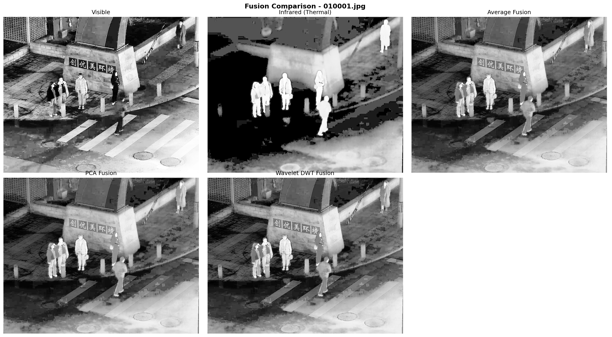
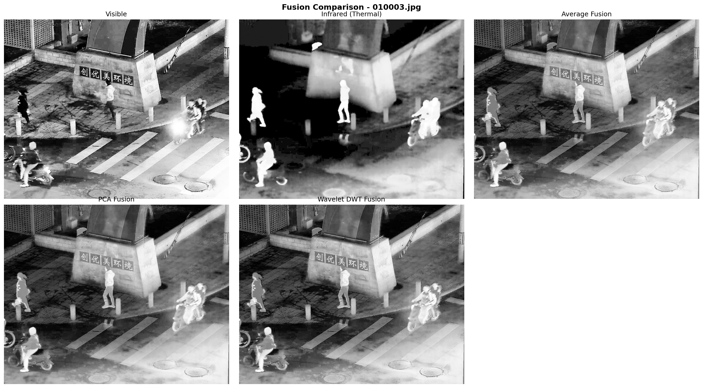

# Multispectral Image Fusion for Perimeter Surveillance

A complete visible and infrared image fusion pipeline for low-light perimeter surveillance. Implements and compares three fusion methods — Simple Average, PCA, and Haar Wavelet DWT — evaluated on the LLVIP dataset using five quantitative metrics.

Built as part of the Digital Image and Video Processing (DIVP) course at Tezpur University.

---

## Results

| Metric | Average Fusion | PCA Fusion | Wavelet Fusion |
|---|---|---|---|
| Entropy (EN) | 7.6946 | 7.7062 | **7.8616** |
| Spatial Frequency (SF) | 0.0521 | 0.0486 | **0.0808** |
| SSIM (vs Visible) | 0.7816 | 0.7411 | **0.7945** |
| SSIM (vs Infrared) | 0.5753 | **0.6046** | 0.5399 |
| PSNR (vs Visible, dB) | 15.7776 | 14.9659 | **15.8465** |
| PSNR (vs Infrared, dB) | 15.7776 | **16.6812** | 15.5353 |
| Edge Intensity (EI) | 42.7660 | 40.0379 | **52.9119** |

Wavelet DWT fusion outperforms both baselines on entropy, spatial frequency, edge intensity, and visible-SSIM — the metrics most critical for surveillance applications.

---

## Sample Output


*Figure 1: Scene with stationary pedestrians — visible, infrared, average, PCA, and wavelet fusion*


*Figure 2: Scene with pedestrians and motorcycles — demonstrating fusion under dynamic conditions*

---

## Pipeline

```
LLVIP Dataset (Visible + Infrared pairs)
            │
            ▼
    preprocessing.py
    - Grayscale conversion
    - Dimension verification
    - Histogram equalization
    - Normalization (0.0 - 1.0)
            │
            ▼
       fusion.py
    ┌─────────────────────────────────┐
    │ 1. Simple Average Fusion        │
    │ 2. PCA Fusion                   │
    │ 3. Haar Wavelet DWT Fusion      │
    └─────────────────────────────────┘
            │
            ▼
      metrics.py
    - Entropy (EN)
    - Spatial Frequency (SF)
    - SSIM (vs visible and infrared)
    - PSNR (vs visible and infrared)
    - Edge Intensity (EI)
            │
            ▼
       utils.py
    - Save fused images
    - Generate comparison figures
```

---

## Project Structure

```
multispectral-image-fusion/
├── preprocessing.py      # Image loading, equalization, normalization
├── fusion.py             # Average, PCA, and Wavelet DWT fusion
├── metrics.py            # Quantitative evaluation metrics
├── utils.py              # Saving results and visualization
├── main.py               # End-to-end pipeline runner
├── samples/              # Sample output comparison figures
│   ├── comparison_010001.jpg.png
│   └── comparison_010003.jpg.png
├── requirements.txt
├── .gitignore
└── README.md
```

---

## Dataset

This project uses the **LLVIP (Low-Light Visible-Infrared Paired)** dataset.

- 16,836 registered visible-infrared image pairs
- Captured in real low-light outdoor surveillance scenarios
- Pre-aligned pairs — no registration required

Download from the official source: [LLVIP Dataset](https://bupt-ai-cj.github.io/LLVIP/)

After downloading, place it in the project root:
```
multispectral-image-fusion/
└── LLVIP/
    ├── visible/
    │   ├── train/
    │   └── test/
    └── infrared/
        ├── train/
        └── test/
```

---

## Setup

**1. Clone the repo**
```bash
git clone https://github.com/yourusername/multispectral-image-fusion.git
cd multispectral-image-fusion
```

**2. Install dependencies**
```bash
pip install -r requirements.txt
```

**3. Download and place the LLVIP dataset** as shown above

**4. Run the full pipeline**
```bash
python main.py
```

Or run individual modules:
```bash
python preprocessing.py   # test preprocessing only
python fusion.py          # test fusion only
python metrics.py         # test metrics only
python utils.py           # generate comparison figures only
```

---

## Requirements

```
opencv-python
numpy
PyWavelets
scikit-image
matplotlib
```

Install all at once:
```bash
pip install opencv-python numpy PyWavelets scikit-image matplotlib
```

---

## How It Works

### Preprocessing
Each image pair goes through grayscale conversion, histogram equalization for contrast enhancement, and normalization to the [0.0, 1.0] float range before fusion.

### Fusion Methods

**Simple Average** — Naive pixel-level averaging. Serves as the baseline.

**PCA Fusion** — Uses eigenvalue decomposition of the covariance matrix of both images to compute data-driven fusion weights. The modality with higher variance contributes more to the fused output.

**Haar Wavelet DWT Fusion** — Decomposes both images into approximation (LL) and detail (LH, HL, HH) sub-bands using the Haar wavelet. Applies weighted averaging to the approximation band and the max-absolute rule to detail bands, then reconstructs via inverse DWT. Spatially adaptive — makes independent fusion decisions at every pixel location based on local edge strength.

### Evaluation
Five no-reference and cross-reference metrics are used since no ground truth fused image exists: Entropy, Spatial Frequency, SSIM, PSNR, and Edge Intensity.

---

## Future Scope

- Hardware deployment on Raspberry Pi / NVIDIA Jetson Nano for real-time fusion
- Three-modality fusion incorporating Near-Infrared (NIR)
- Real-time operator monitoring interface
- Comparison with deep learning fusion methods

---

## References

1. Lewis et al. (2016). Pixel- and region-based image fusion with complex wavelets. *Sensors, MDPI.*
2. Jia et al. (2021). LLVIP: A Visible-Infrared Paired Dataset for Low-Light Vision. *ICCVW 2021.*
3. Naidu & Raul (2008). Pixel-Level Image Fusion Using Wavelets and PCA. *Defence Science Journal.*

---

## Author

**Swakshar Bora**
B.Tech ECE, 6th Semester
Tezpur University, Assam
